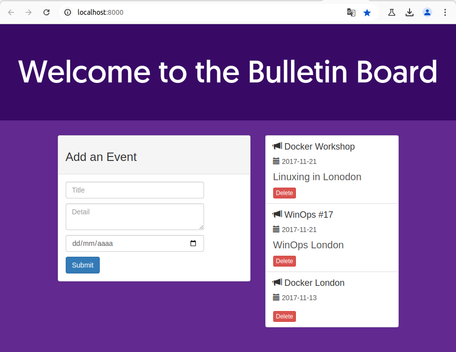
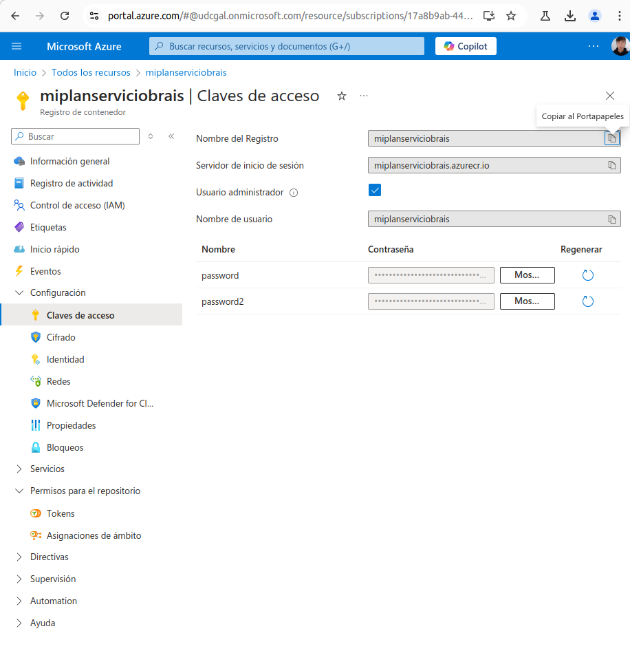
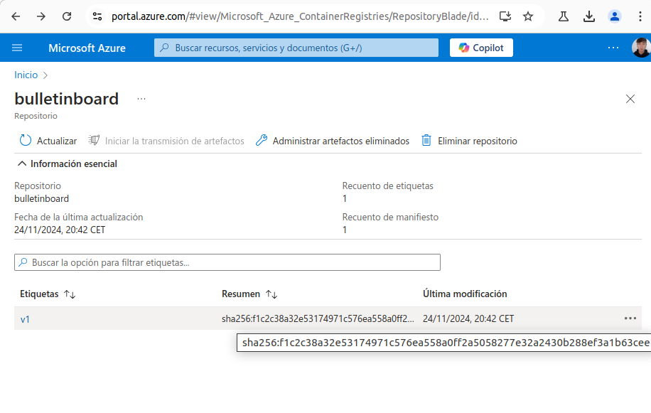
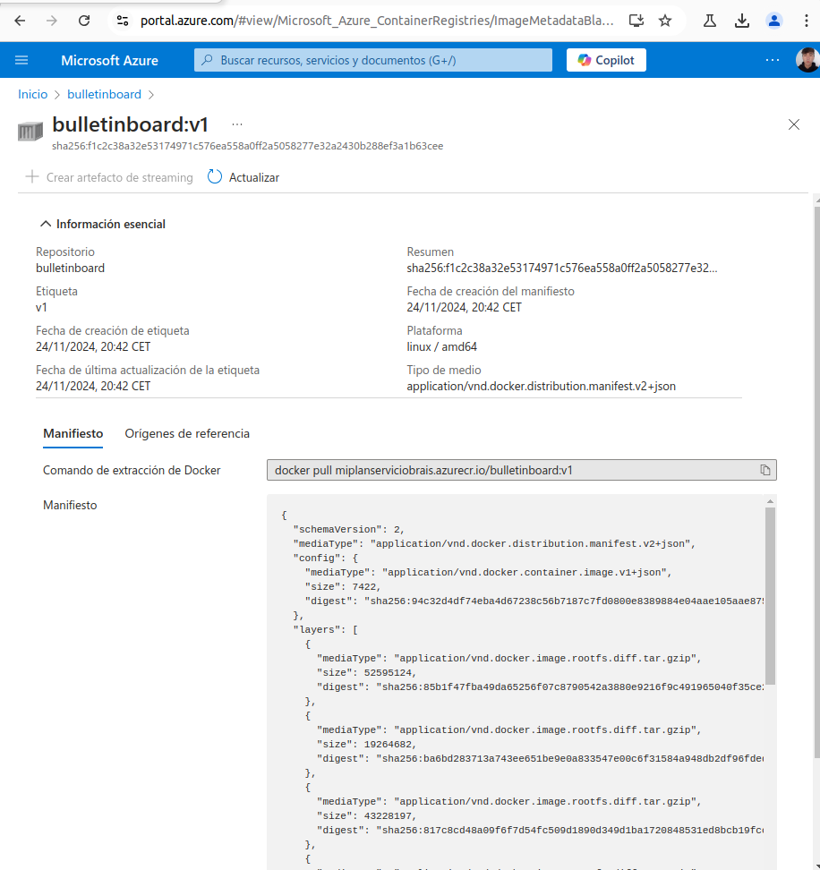
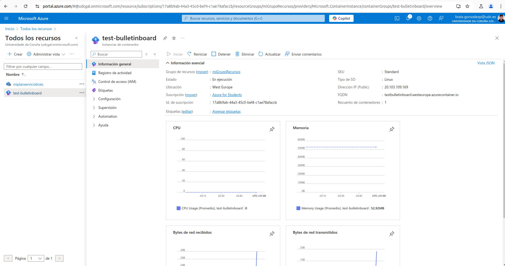
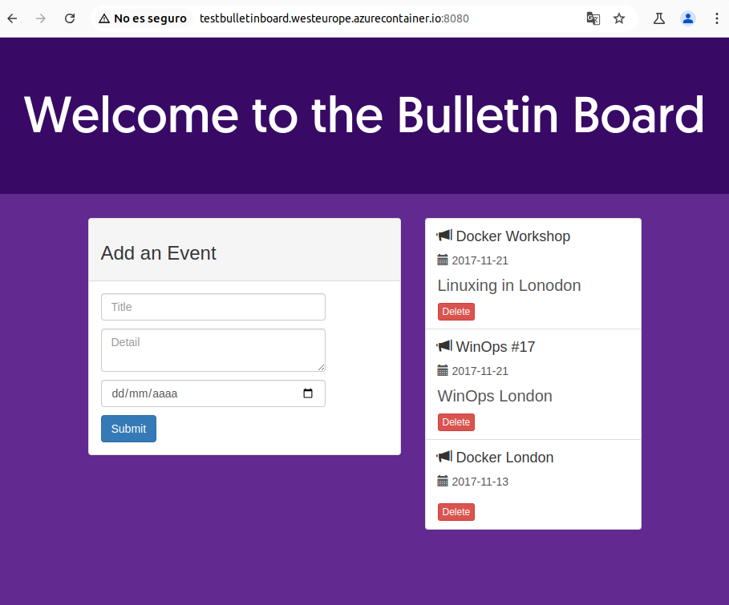

# Practica de Azure (SaaS)
> Brais González Piñeiro \<brais.gonzalezp@udc.es\>
## Tutorial
### Configuración del entorno
Clonamos el repositorio que vamsos a utilizar:
```bash
brais@braisGonzalez:~/Documentos/Azure$ mkdir ics-master
brais@braisGonzalez:~/Documentos/Azure$ cd ics-master/
brais@braisGonzalez:~/Documentos/Azure/ics-master$ git clone -b v1 https://github.com/docker-training/node-  bulletin-board
Clonando en 'node-bulletin-board'...
remote: Enumerating objects: 213, done.
remote: Counting objects: 100% (23/23), done.
remote: Compressing objects: 100% (19/19), done.
remote: Total 213 (delta 8), reused 17 (delta 4), pack-reused 190 (from 1)
Recibiendo objetos: 100% (213/213), 197.64 KiB | 1.28 MiB/s, listo.
Resolviendo deltas: 100% (90/90), listo.
brais@braisGonzalez:~/Documentos/Azure/ics-master$ cd node-bulletin-board/bulletin-board-app/
brais@braisGonzalez:~/Documentos/Azure/ics-master/node-bulletin-board/bulletin-board-app$ ls
app.js   Dockerfile  index.html  package.json  server.js
backend  fonts       LICENSE     readme.md     site.css
brais@braisGonzalez:~/Documentos/Azure/ics-master/node-bulletin-board/bulletin-board-app$
```
Comprobamos que es el mismo dockerfile:
```bash
brais@braisGonzalez:~/Documentos/Azure/ics-master/node-bulletin-board/bulletin-board-app$ cat Dockerfile 
FROM node:6.11.5

WORKDIR /usr/src/app
COPY package.json .
RUN npm install
COPY . .

CMD [ "npm", "start" ]
```
y el mismo json:

```bash
brais@braisGonzalez:~/Documentos/Azure/ics-master/node-bulletin-board/bulletin-board-app$ cat package.json 
{
  "name": "vue-event-bulletin",
  "version": "1.0.0",
  "description": "Demo application for the scotch.io tutorial",
  "main": "server.js",
  "author": "Ryan Chenkie, Jason Lam",
  "license": "MIT",
  "dependencies": {
    "bootstrap": "^3.3.6",
    "ejs": "^2.3.4",
    "express": "^4.13.3",
    "morgan": "^1.6.1",
    "vue": "^1.0.10",
    "vue-resource": "^0.1.17"
  },
  "devDependencies": {
    "body-parser": "^1.14.1",
    "errorhandler": "^1.4.2",
    "method-override": "^2.3.5",
    "morgan": "^1.6.1"
  }
}
```
## DOCKER
Necesitamos usar Docker sin permisos de root por lo que haremos lo siguiente:
1. Creamos un grupo docker(yo ya he trabajado con socker anteriormente por lo que este grupo ya lo tengo creado):
```bash
brais@braisGonzalez:~/Documentos/Azure/ics-master/node-bulletin-board/bulletin-board-app$ sudo groupadd docker
sudo: imposible resolver el anfitrión braisGonzalez: Nombre o servicio desconocido
[sudo] contraseña para brais: 
groupadd: el grupo «docker» ya existe
```
2. Añadimos el usuario al grupo y reiniciamos para guardar cambios:
```bash
brais@braisGonzalez:~/Documentos/Azure/ics-master/node-bulletin-board/bulletin-board-app$  sudo usermod -aG docker $USER
```
## Docker service
Comprobamos que docker esta corriendo correctamente en nuestro sistema operativo:
```bash
brais@braisGonzalez:~/Documentos/Azure/ics-master/node-bulletin-board/bulletin-board-app$ systemctl status docker
● docker.service - Docker Application Container Engine
     Loaded: loaded (/lib/systemd/system/docker.service; enabled; vendor preset: enabled)
     Active: active (running) since Sun 2024-11-24 18:31:51 CET; 39min ago
TriggeredBy: ● docker.socket
       Docs: https://docs.docker.com
   Main PID: 1898 (dockerd)
      Tasks: 30
     Memory: 119.5M
        CPU: 927ms
     CGroup: /system.slice/docker.service
             └─1898 /usr/bin/dockerd -H fd:// --containerd=/run/containerd/containerd.sock

nov 24 18:31:51 braisGonzalez systemd[1]: Starting Docker Application Container Engine...
nov 24 18:31:51 braisGonzalez dockerd[1898]: time="2024-11-24T18:31:51.218050700+01:00" level=info >
nov 24 18:31:51 braisGonzalez dockerd[1898]: time="2024-11-24T18:31:51.279633374+01:00" level=info >
nov 24 18:31:51 braisGonzalez dockerd[1898]: time="2024-11-24T18:31:51.341519782+01:00" level=info >
nov 24 18:31:51 braisGonzalez dockerd[1898]: time="2024-11-24T18:31:51.737800505+01:00" level=info >
nov 24 18:31:51 braisGonzalez dockerd[1898]: time="2024-11-24T18:31:51.783775745+01:00" level=info >
nov 24 18:31:51 braisGonzalez dockerd[1898]: time="2024-11-24T18:31:51.792967665+01:00" level=info >
nov 24 18:31:51 braisGonzalez dockerd[1898]: time="2024-11-24T18:31:51.793342285+01:00" level=info >
nov 24 18:31:51 braisGonzalez dockerd[1898]: time="2024-11-24T18:31:51.833178180+01:00" level=info >
nov 24 18:31:51 braisGonzalez systemd[1]: Started Docker Application Container Engine.
lines 1-22/22 (END)
```
## Docker Image Build
Ya podemos pasar a generar la imagen docker:
```bash
brais@braisGonzalez:~/Documentos/Azure/ics-master/node-bulletin-board/bulletin-board-app$ docker image build -t bulletinboard:1.0 .
[+] Building 30.6s (10/10) FINISHED                                                                 
 => [internal] load .dockerignore                                                              0.0s
 => => transferring context: 2B                                                                0.0s
 => [internal] load build definition from Dockerfile                                           0.0s
 => => transferring dockerfile: 146B                                                           0.0s
 => [internal] load metadata for docker.io/library/node:6.11.5                                 2.1s
 => [internal] load build context                                                              0.0s
 => => transferring context: 32.77kB                                                           0.0s
 => [1/5] FROM docker.io/library/node:6.11.5@sha256:fe109b92edafd9821fbc1c80fd7587a1b4e1ff76  17.9s
 => => resolve docker.io/library/node:6.11.5@sha256:fe109b92edafd9821fbc1c80fd7587a1b4e1ff76f  0.0s
 => => sha256:852391892b9f2cf86cce28977a6594bb5b118d97da4b48c56ea6f5fe18b975d 7.08kB / 7.08kB  0.0s
 => => sha256:ba6bd283713a743ee651be9e0a833547e00c6f31584a948db2df96fded4de 19.26MB / 19.26MB  5.1s
 => => sha256:fe109b92edafd9821fbc1c80fd7587a1b4e1ff76fec3af675869e23e50bbf45 2.04kB / 2.04kB  0.0s
 => => sha256:e1da6883876418aa60725654dbf76dba875d844bba4c20e36d0e9bf56e190f8 2.01kB / 2.01kB  0.0s
 => => sha256:85b1f47fba49da65256f07c8790542a3880e9216f9c491965040f35ce2c6c 52.60MB / 52.60MB  6.0s
 => => sha256:817c8cd48a09f6f7d54fc509d1890d349d1ba1720848531ed8bcb19fccc42 43.23MB / 43.23MB  6.1s
 => => sha256:47cc0ed96dc3a88c79f26dc97950ec81a5c35699f48f07662f99c97412 134.93MB / 134.93MB  13.6s
 => => sha256:8888adcbd08b22208eec8b1719ae91391c156962567f4e443db015e0bb4da65 4.42kB / 4.42kB  6.2s
 => => extracting sha256:85b1f47fba49da65256f07c8790542a3880e9216f9c491965040f35ce2c6ca7a      2.0s
 => => sha256:6f2de60646b92af71b80e4be2594b0506b3ccddf357c5567cbb42403ab2 116.48kB / 116.48kB  6.3s
 => => sha256:1666693bf9968584f1705c17141a510818b1fbd1e7dea99a4e4c4f9038f60 14.42MB / 14.42MB  7.8s
 => => sha256:2fe410df7942f8a05bbed941ffa187db5ed887af54ff8ba9f9e671393da28b1 1.01MB / 1.01MB  6.8s
 => => extracting sha256:ba6bd283713a743ee651be9e0a833547e00c6f31584a948db2df96fded4def55      0.5s
 => => extracting sha256:817c8cd48a09f6f7d54fc509d1890d349d1ba1720848531ed8bcb19fccc42962      1.8s
 => => extracting sha256:47cc0ed96dc3a88c79f26dc97950ec81a5c35699f48f07662f99c97412af6e95      3.1s
 => => extracting sha256:8888adcbd08b22208eec8b1719ae91391c156962567f4e443db015e0bb4da654      0.0s
 => => extracting sha256:6f2de60646b92af71b80e4be2594b0506b3ccddf357c5567cbb42403ab296c8e      0.0s
 => => extracting sha256:1666693bf9968584f1705c17141a510818b1fbd1e7dea99a4e4c4f9038f60e91      0.7s
 => => extracting sha256:2fe410df7942f8a05bbed941ffa187db5ed887af54ff8ba9f9e671393da28b13      0.1s
 => [2/5] WORKDIR /usr/src/app                                                                 0.3s
 => [3/5] COPY package.json .                                                                  0.0s
 => [4/5] RUN npm install                                                                     10.0s
 => [5/5] COPY . .                                                                             0.0s
 => exporting to image                                                                         0.3s 
 => => exporting layers                                                                        0.3s 
 => => writing image sha256:94c32d4df74eba4d67238c56b7187c7fd0800e8389884e04aae105aae8757839   0.0s 
 => => naming to docker.io/library/bulletinboard:1.0                                           0.0s
```
## Docker Container Run
Una vez generada la imagen docker podemos pasar a ejecutarla, para ello necesitamos levantar el contenedor y conectar el puerto 8000 de la máquina local con el 8080 del contenedor. Para ello usaremos lo siguiente:
```bash
brais@braisGonzalez:~/Documentos/Azure/ics-master/node-bulletin-board/bulletin-board-app$ docker container run --publish 8000:8080 --detach --name bb bulletinboard:1.0
74bd1faf2ebb3558b378fcbff76770e368016c5887e32ea2603882b267805854
```
De esta formas ya tendriamos el contenedor corriendo, y para conectarnos solo tendriamos que buscar en nuestro navegador la dirección http://localhost:8000/. El resultado se vería de la siguiente manera:



## Docker ps
Para saber los contenedores que tenmos corriendo haríamos lo siguiente:
```bash
brais@braisGonzalez:~/Documentos/Azure/ics-master/node-bulletin-board/bulletin-board-app$ docker ps
CONTAINER ID   IMAGE               COMMAND                  CREATED         STATUS          PORTS                    NAMES
74bd1faf2ebb   bulletinboard:1.0   "npm start"              5 minutes ago   Up 5 minutes    0.0.0.0:8000->8080/tcp   bb
```
Y para eliminarlo sin pararlo:
```bash
brais@braisGonzalez:~/Documentos/Azure/ics-master/node-bulletin-board/bulletin-board-app$ docker container rm --force bb
bb
```
## Docker images
Se pueden listar todas las imagenes generadas de la siguiente forma:
```bash
brais@braisGonzalez:~/Documentos/Azure/ics-master/node-bulletin-board/bulletin-board-app$ docker images
REPOSITORY                       TAG       IMAGE ID       CREATED          SIZE
bulletinboard                    1.0       94c32d4df74e   14 minutes ago   689MB
```
## Docker rmi
Para eliminar imagenes del sistema se haría:
```bash
brais@braisGonzalez:~/Documentos/Azure/ics-master/node-bulletin-board/bulletin-board-app$ docker rmi 94c32d4df74e
Untagged: bulletinboard:1.0
Deleted: sha256:94c32d4df74eba4d67238c56b7187c7fd0800e8389884e04aae105aae8757839
```
Como resultado al volver al listar las imagenes veríamos:
```bash
brais@braisGonzalez:~/Documentos/Azure/ics-master/node-bulletin-board/bulletin-board-app$ docker images
REPOSITORY                       TAG       IMAGE ID       CREATED          SIZE
```
## Docker Search
También se pueden buscar imágenes, por ejemplo vamos a probar a buscar imágenes de centOS:
```bash
brais@braisGonzalez:~/Documentos/Azure/ics-master/node-bulletin-board/bulletin-board-app$ docker search centos
NAME                           DESCRIPTION                                     STARS     OFFICIAL
centos                         DEPRECATED; The official build of CentOS.       7757      [OK]
centos/postgresql-10-centos7   PostgreSQL is an advanced Object-Relational …   20        
centos/httpd-24-centos8                                                        3         
corpusops/centos               centos corpusops baseimage                      0         
centos/redis-5-centos8                                                         0         
centos/systemd                 systemd enabled base container.                 115       
centos/postgresql-96-centos7   PostgreSQL is an advanced Object-Relational …   45        
centos/postgresql-10-centos8                                                   0         
centos/mysql-80-centos8                                                        0         
centos/mongodb-36-centos7      MongoDB NoSQL database server                   12        
centos/nginx-112-centos7       Platform for running nginx 1.12 or building …   16        
centos/mariadb-103-centos8                                                     2         
centos/postgresql-12-centos8                                                   0         
centos/mysql-56-centos7        MySQL 5.6 SQL database server                   23        
centos/mariadb-101-centos7     MariaDB 10.1 SQL database server                13        
centos/mariadb-102-centos7     MariaDB 10.2 SQL database server                6         
centos/mysql-57-centos7        MySQL 5.7 SQL database server                   95        
centos/ruby-25-centos7         Platform for building and running Ruby 2.5 a…   3         
centos/redis-32-centos7        Redis in-memory data structure store, used a…   6         
centos/httpd-24-centos7        Platform for running Apache httpd 2.4 or bui…   46        
centos/php-56-centos7          Platform for building and running PHP 5.6 ap…   34        
centos/nginx-18-centos7        Platform for running nginx 1.8 or building n…   14        
centos/redis-5-centos7         Redis in-memory data structure store, used a…   0         
centos/python-35-centos7       Platform for building and running Python 3.5…   39        
centos/postgresql-12-centos7   PostgreSQL is an advanced Object-Relational …   5
```
## Docker image pull
Para descargar imágenes haríamos:
```bash
brais@braisGonzalez:~/Documentos/Azure/ics-master/node-bulletin-board/bulletin-board-app$ docker image pull kinogmt/centos-ssh
Using default tag: latest
latest: Pulling from kinogmt/centos-ssh
Image docker.io/kinogmt/centos-ssh:latest uses outdated schema1 manifest format. Please upgrade to a schema2 image for better future compatibility. More information at https://docs.docker.com/registry/spec/deprecated-schema-v1/
a3ed95caeb02: Pull complete 
3b231ed5aa2f: Pull complete 
b73faae918f1: Pull complete 
2f96ec4f912b: Pull complete 
50ad9044db90: Pull complete 
ba40dad95ca2: Pull complete 
1d7a70b1b1da: Pull complete 
365930eae884: Pull complete 
7568f1af3835: Pull complete 
Digest: sha256:acdf7798259f859a8e713f2f88511eef5e0f94cb2d2dec078a1fe169a8aacf63
Status: Downloaded newer image for kinogmt/centos-ssh:latest
docker.io/kinogmt/centos-ssh:latest
```
Vamos a comprobar que se ha descargado correctamente:
```bash
brais@braisGonzalez:~/Documentos/Azure/ics-master/node-bulletin-board/bulletin-board-app$ docker images
REPOSITORY                       TAG       IMAGE ID       CREATED         SIZE
kinogmt/centos-ssh               latest    dc8713dad282   8 years ago     773MB
```
## Docker container run -it
Podemos ejecutar una maquina y conectarnos de la siguiente forma:
```bash
brais@braisGonzalez:~/Documentos/Azure/ics-master/node-bulletin-board/bulletin-board-app$ docker container run -it kinogmt/centos-ssh /bin/bash
[root@754e3f1818f5 /]# rpm -q centos-release
centos-release-6-7.el6.centos.12.3.x86_64
[root@754e3f1818f5 /]# 
```
## Docker logs
Para comprobar los logs de una maquina:
```bash
docker logs <container_id>
```
## Limpieza del sistema
Una vez acabado necesitamos limpiar los contenedores e imágenes que ya no vamos a utilizar, para ello primero veremos que recursos no necesitamos
```bash
brais@braisGonzalez:~/Documentos/Azure/ics-master/node-bulletin-board/bulletin-board-app$ docker image ls
REPOSITORY           TAG       IMAGE ID       CREATED       SIZE
kinogmt/centos-ssh   latest    dc8713dad282   8 years ago   773MB
brais@braisGonzalez:~/Documentos/Azure/ics-master/node-bulletin-board/bulletin-board-app$ docker container ps
CONTAINER ID   IMAGE     COMMAND   CREATED   STATUS    PORTS     NAMES
brais@braisGonzalez:~/Documentos/Azure/ics-master/node-bulletin-board/bulletin-board-app$ docker container ls -a
CONTAINER ID   IMAGE                COMMAND       CREATED         STATUS                       PORTS     NAMES
754e3f1818f5   kinogmt/centos-ssh   "/bin/bash"   7 minutes ago   Exited (127) 3 minutes ago             brave_poincare
```
Ahora eliminaremos primero el contenedor y luego la imagen de la siguiente manera:
```bash
brais@braisGonzalez:~/Documentos/Azure/ics-master/node-bulletin-board/bulletin-board-app$ docker rmi -f dc8713dad282
Untagged: kinogmt/centos-ssh:latest
Untagged: kinogmt/centos-ssh@sha256:acdf7798259f859a8e713f2f88511eef5e0f94cb2d2dec078a1fe169a8aacf63
Deleted: sha256:dc8713dad28219f7be85c1c7ab08fa858905d7b4f78bf4999e6cdcd36eae2377
brais@braisGonzalez:~/Documentos/Azure/ics-master/node-bulletin-board/bulletin-board-app$ docker container rm 754e3f1818f5
754e3f1818f5
```
## AZURE
## Alta cuenta azure
Lo primero que debemos de hacer es darnos de alta en la cuenta de azure:

## Instalar consola de azure
Instalar consola
```bash
curl -sL https://aka.ms/InstallAzureCLIDeb | sudo bash
```
Instalar helm
```bash
brais@braisGonzalez:~/Documentos/Azure/ics-master/node-bulletin-board/bulletin-board-app$ curl https://raw.githubusercontent.com/helm/helm/master/scripts/get-helm-3 | bash
  % Total    % Received % Xferd  Average Speed   Time    Time     Time  Current
                                 Dload  Upload   Total   Spent    Left  Speed
100 11903  100 11903    0     0  39316      0 --:--:-- --:--:-- --:--:-- 39413
Downloading https://get.helm.sh/helm-v3.16.3-linux-amd64.tar.gz
Verifying checksum... Done.
Preparing to install helm into /usr/local/bin
sudo: imposible resolver el anfitrión braisGonzalez: Nombre o servicio desconocido
helm installed into /usr/local/bin/helm
```
## Login a Azure desde consola
```bash
brais@braisGonzalez:~/Documentos/Azure/ics-master/node-bulletin-board/bulletin-board-app$ az login
A web browser has been opened at https://login.microsoftonline.com/organizations/oauth2/v2.0/authorize. Please continue the login in the web browser. If no web browser is available or if the web browser fails to open, use device code flow with `az login --use-device-code`.

Retrieving tenants and subscriptions for the selection...

[Tenant and subscription selection]

No     Subscription name    Subscription ID                       Tenant
-----  -------------------  ------------------------------------  ----------------------
[1] *  Azure for Students   17a8b9ab-44a3-45c0-bef4-c1ae78afaccb  Universidade da Coruña

The default is marked with an *; the default tenant is 'Universidade da Coruña' and subscription is 'Azure for Students' (17a8b9ab-44a3-45c0-bef4-c1ae78afaccb).

Select a subscription and tenant (Type a number or Enter for no changes): 

Tenant: Universidade da Coruña
Subscription: Azure for Students (17a8b9ab-44a3-45c0-bef4-c1ae78afaccb)

[Announcements]
With the new Azure CLI login experience, you can select the subscription you want to use more easily. Learn more about it and its configuration at https://go.microsoft.com/fwlink/?linkid=2271236

If you encounter any problem, please open an issue at https://aka.ms/azclibug

[Warning] The login output has been updated. Please be aware that it no longer displays the full list of available subscriptions by default.
```
## Creación del Container Registry
Para crear imagenes docker privadas primero necesitamos crear un Container Registry. Los pasos a seguir son:
1. Crear grupo de recursos
```bash
brais@braisGonzalez:~/Documentos/Azure/ics-master/node-bulletin-board/bulletin-board-app$ az group create --name miGrupoRecursos --location "West Europe"
{
  "id": "/subscriptions/17a8b9ab-44a3-45c0-bef4-c1ae78afaccb/resourceGroups/miGrupoRecursos",
  "location": "westeurope",
  "managedBy": null,
  "name": "miGrupoRecursos",
  "properties": {
    "provisioningState": "Succeeded"
  },
  "tags": null,
  "type": "Microsoft.Resources/resourceGroups"
}
```

2. Crear el Continer Registry:
```bash
brais@braisGonzalez:~/Documentos/Azure/ics-master/node-bulletin-board/bulletin-board-app$ az acr create --name miplanserviciobrais --resource-group miGrupoRecursos --sku Basic
Resource provider 'Microsoft.ContainerRegistry' used by this operation is not registered. We are registering for you.
Registration succeeded.
{
  "adminUserEnabled": false,
  "anonymousPullEnabled": false,
  "creationDate": "2024-11-24T19:16:09.296503+00:00",
  "dataEndpointEnabled": false,
  "dataEndpointHostNames": [],
  "encryption": {
    "keyVaultProperties": null,
    "status": "disabled"
  },
  "id": "/subscriptions/17a8b9ab-44a3-45c0-bef4-c1ae78afaccb/resourceGroups/miGrupoRecursos/providers/Microsoft.ContainerRegistry/registries/miplanserviciobrais",
  "identity": null,
  "location": "westeurope",
  "loginServer": "miplanserviciobrais.azurecr.io",
  "metadataSearch": "Disabled",
  "name": "miplanserviciobrais",
  "networkRuleBypassOptions": "AzureServices",
  "networkRuleSet": null,
  "policies": {
    "azureAdAuthenticationAsArmPolicy": {
      "status": "enabled"
    },
    "exportPolicy": {
      "status": "enabled"
    },
    "quarantinePolicy": {
      "status": "disabled"
    },
    "retentionPolicy": {
      "days": 7,
      "lastUpdatedTime": "2024-11-24T19:16:17.690389+00:00",
      "status": "disabled"
    },
    "softDeletePolicy": {
      "lastUpdatedTime": "2024-11-24T19:16:17.690446+00:00",
      "retentionDays": 7,
      "status": "disabled"
    },
    "trustPolicy": {
      "status": "disabled",
      "type": "Notary"
    }
  },
  "privateEndpointConnections": [],
  "provisioningState": "Succeeded",
  "publicNetworkAccess": "Enabled",
  "resourceGroup": "miGrupoRecursos",
  "sku": {
    "name": "Basic",
    "tier": "Basic"
  },
  "status": null,
  "systemData": {
    "createdAt": "2024-11-24T19:16:09.296503+00:00",
    "createdBy": "brais.gonzalezp@udc.es",
    "createdByType": "User",
    "lastModifiedAt": "2024-11-24T19:16:09.296503+00:00",
    "lastModifiedBy": "brais.gonzalezp@udc.es",
    "lastModifiedByType": "User"
  },
  "tags": {},
  "type": "Microsoft.ContainerRegistry/registries",
  "zoneRedundancy": "Disabled"
}
```
## Push de la imagen al Container registry de Azure
Primero verificamos que ellogin es correcto:
```bash
brais@braisGonzalez:~/Documentos/Azure/ics-master/node-bulletin-board/bulletin-board-app$ az acr login --name miplanserviciobrais 
Login Succeeded
```
Generamos el tag para hacer el push de la imagen:
```bash
docker tag bulletinboard:1.0 miplanserviciobrais.azurecr.io/bulletinboard:v1
```
Vemos que está bien creada:
```bash
brais@braisGonzalez:~/Documentos/Azure/ics-master/node-bulletin-board/bulletin-board-app$ docker images
REPOSITORY                                     TAG       IMAGE ID       CREATED             SIZE
bulletinboard                                  1.0       94c32d4df74e   About an hour ago   689MB
miplanserviciobrais.azurecr.io/bulletinboard   v1        94c32d4df74e   About an hour ago   689MB
```
Necesitamos habilitar el login ya que se trata de un repo privado, para ello activaremos el admin:
```bash
brais@braisGonzalez:~/Documentos/Azure/ics-master/node-bulletin-board/bulletin-board-app$ az acr update -n miplanserviciobrais --admin-enabled true
{
  "adminUserEnabled": true,
  "anonymousPullEnabled": false,
  "creationDate": "2024-11-24T19:16:09.296503+00:00",
  "dataEndpointEnabled": false,
  "dataEndpointHostNames": [],
  "encryption": {
    "keyVaultProperties": null,
    "status": "disabled"
  },
  "id": "/subscriptions/17a8b9ab-44a3-45c0-bef4-c1ae78afaccb/resourceGroups/miGrupoRecursos/providers/Microsoft.ContainerRegistry/registries/miplanserviciobrais",
  "identity": null,
  "location": "westeurope",
  "loginServer": "miplanserviciobrais.azurecr.io",
  "metadataSearch": "Disabled",
  "name": "miplanserviciobrais",
  "networkRuleBypassOptions": "AzureServices",
  "networkRuleSet": null,
  "policies": {
    "azureAdAuthenticationAsArmPolicy": {
      "status": "enabled"
    },
    "exportPolicy": {
      "status": "enabled"
    },
    "quarantinePolicy": {
      "status": "disabled"
    },
    "retentionPolicy": {
      "days": 7,
      "lastUpdatedTime": "2024-11-24T19:16:17.690389+00:00",
      "status": "disabled"
    },
    "softDeletePolicy": {
      "lastUpdatedTime": "2024-11-24T19:16:17.690446+00:00",
      "retentionDays": 7,
      "status": "disabled"
    },
    "trustPolicy": {
      "status": "disabled",
      "type": "Notary"
    }
  },
  "privateEndpointConnections": [],
  "provisioningState": "Succeeded",
  "publicNetworkAccess": "Enabled",
  "resourceGroup": "miGrupoRecursos",
  "sku": {
    "name": "Basic",
    "tier": "Basic"
  },
  "status": null,
  "systemData": {
    "createdAt": "2024-11-24T19:16:09.296503+00:00",
    "createdBy": "brais.gonzalezp@udc.es",
    "createdByType": "User",
    "lastModifiedAt": "2024-11-24T19:30:53.003328+00:00",
    "lastModifiedBy": "brais.gonzalezp@udc.es",
    "lastModifiedByType": "User"
  },
  "tags": {},
  "type": "Microsoft.ContainerRegistry/registries",
  "zoneRedundancy": "Disabled"
}
```
Como podemos ver en la consola de azure se ha activado correctamente:





Probamos ahora a hacer login desde la consola:
```bash
brais@braisGonzalez:~/Documentos/Azure/ics-master/node-bulletin-board/bulletin-board-app$ docker login miplanserviciobrais.azurecr.io
Username: miplanserviciobrais
Password: 
Login Succeeded
```
Ahora ya podemos hacer el push:
```bash
brais@braisGonzalez:~/Documentos/Azure/ics-master/node-bulletin-board/bulletin-board-app$ docker push miplanserviciobrais.azurecr.io/bulletinboard:v1
The push refers to repository [miplanserviciobrais.azurecr.io/bulletinboard]
4992278b9852: Pushed 
91e6543813c9: Pushed 
38391c71900f: Pushed 
10e7258451c2: Pushed 
dd883cbb0cf7: Pushed 
a3a3f69aebe8: Pushed 
0da372da714b: Pushed 
bf3841becf9d: Pushed 
63866df00998: Pushed 
2f9128310b77: Pushed 
d9a5f9b8d5c2: Pushed 
c01c63c6823d: Pushed 
v1: digest: sha256:f1c2c38a32e53174971c576ea558a0ff2a5058277e32a2430b288ef3a1b63cee size: 2841
```
Y comprobamos que la imagen está subida en azure:




## Creación del contenedor con la imagen recién subida a Azure

Creamos el contenedor con las instrucciones necesarias:
```bash
brais@braisGonzalez:~/Documentos/Azure/ics-master/node-bulletin-board/bulletin-board-app$ az container create --resource-group miGrupoRecursos --name test-bulletinboard --image miplanserviciobrais.azurecr.io/bulletinboard:v1 --dns-name-label testbulletinboard --ports 8080 --os-type Linux --cpu 1 --memory 1.5
Image registry username: miplanserviciobrais
Image registry password: 
{
  "confidentialComputeProperties": null,
  "containerGroupProfile": null,
  "containers": [
    {
      "command": null,
      "configMap": {
        "keyValuePairs": {}
      },
      "environmentVariables": [],
      "image": "miplanserviciobrais.azurecr.io/bulletinboard:v1",
      "instanceView": {
        "currentState": {
          "detailStatus": "",
          "exitCode": null,
          "finishTime": null,
          "startTime": "2024-11-24T19:56:35.710000+00:00",
          "state": "Running"
        },
        "events": [
          {
            "count": 1,
            "firstTimestamp": "2024-11-24T19:56:00+00:00",
            "lastTimestamp": "2024-11-24T19:56:00+00:00",
            "message": "pulling image \"miplanserviciobrais.azurecr.io/bulletinboard@sha256:f1c2c38a32e53174971c576ea558a0ff2a5058277e32a2430b288ef3a1b63cee\"",
            "name": "Pulling",
            "type": "Normal"
          },
          {
            "count": 1,
            "firstTimestamp": "2024-11-24T19:56:24+00:00",
            "lastTimestamp": "2024-11-24T19:56:24+00:00",
            "message": "Successfully pulled image \"miplanserviciobrais.azurecr.io/bulletinboard@sha256:f1c2c38a32e53174971c576ea558a0ff2a5058277e32a2430b288ef3a1b63cee\"",
            "name": "Pulled",
            "type": "Normal"
          },
          {
            "count": 1,
            "firstTimestamp": "2024-11-24T19:56:35+00:00",
            "lastTimestamp": "2024-11-24T19:56:35+00:00",
            "message": "Started container",
            "name": "Started",
            "type": "Normal"
          }
        ],
        "previousState": null,
        "restartCount": 0
      },
      "livenessProbe": null,
      "name": "test-bulletinboard",
      "ports": [
        {
          "port": 8080,
          "protocol": "TCP"
        }
      ],
      "readinessProbe": null,
      "resources": {
        "limits": null,
        "requests": {
          "cpu": 1.0,
          "gpu": null,
          "memoryInGb": 1.5
        }
      },
      "securityContext": null,
      "volumeMounts": null
    }
  ],
  "diagnostics": null,
  "dnsConfig": null,
  "encryptionProperties": null,
  "extensions": null,
  "id": "/subscriptions/17a8b9ab-44a3-45c0-bef4-c1ae78afaccb/resourceGroups/miGrupoRecursos/providers/Microsoft.ContainerInstance/containerGroups/test-bulletinboard",
  "identity": null,
  "imageRegistryCredentials": [
    {
      "identity": null,
      "identityUrl": null,
      "isDelegatedIdentity": false,
      "password": null,
      "server": "miplanserviciobrais.azurecr.io",
      "username": "miplanserviciobrais"
    }
  ],
  "initContainers": [],
  "instanceView": {
    "events": [],
    "state": "Running"
  },
  "ipAddress": {
    "autoGeneratedDomainNameLabelScope": "Unsecure",
    "dnsNameLabel": "testbulletinboard",
    "fqdn": "testbulletinboard.westeurope.azurecontainer.io",
    "ip": "20.103.109.169",
    "ports": [
      {
        "port": 8080,
        "protocol": "TCP"
      }
    ],
    "type": "Public"
  },
  "isCreatedFromStandbyPool": false,
  "location": "westeurope",
  "name": "test-bulletinboard",
  "osType": "Linux",
  "priority": null,
  "provisioningState": "Succeeded",
  "resourceGroup": "miGrupoRecursos",
  "restartPolicy": null,
  "sku": "Standard",
  "standbyPoolProfile": null,
  "subnetIds": null,
  "tags": {},
  "type": "Microsoft.ContainerInstance/containerGroups",
  "volumes": null,
  "zones": null
}
```
## Visitando la página web
Ahora solo tenemos que comprobar que todo hay ido bien:
```bash
brais@braisGonzalez:~/Documentos/Azure/ics-master/node-bulletin-board/bulletin-board-app$ az container logs --resource-group miGrupoRecursos --name test-bulletinboard

> vue-event-bulletin@1.0.0 start /usr/src/app
> node server.js

Magic happens on port 8080...
GET / 200 9.161 ms - 1825
```
y vemos si el contenedor está en ejecución y entramos en el FQDN para comprobar si se puede acceder:




También podemos observar los logs para obtener mas información:
```bash
brais@braisGonzalez:~/Documentos/Azure/ics-master/node-bulletin-board/bulletin-board-app$ az container logs --resource-group miGrupoRecursos --name test-bulletinboard

> vue-event-bulletin@1.0.0 start /usr/src/app
> node server.js

Magic happens on port 8080...
GET / 200 9.161 ms - 1825
GET / 200 1.816 ms - 1825
GET / 200 3.316 ms - 1825
GET /site.css 200 1.991 ms - 1227
GET /node_modules/bootstrap/dist/css/bootstrap.min.css 200 5.729 ms - 121457
GET /app.js 200 1.383 ms - 1238
GET /node_modules/vue-resource/dist/vue-resource.min.js 200 6.708 ms - 9193
GET /node_modules/vue/dist/vue.min.js 200 6.485 ms - 77475
GET /fonts/geomanist/hinted-Geomanist-Book.woff2 200 2.824 ms - 23504
GET /node_modules/bootstrap/dist/fonts/glyphicons-halflings-regular.woff2 200 4.055 ms - 18028
GET /api/events 200 6.159 ms - 216
GET /favicon.ico 404 3.245 ms - 150
```


