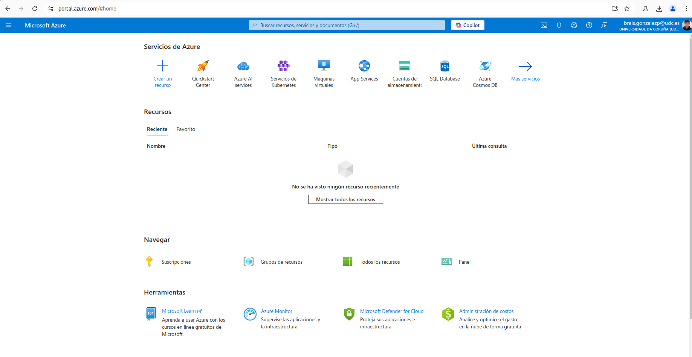
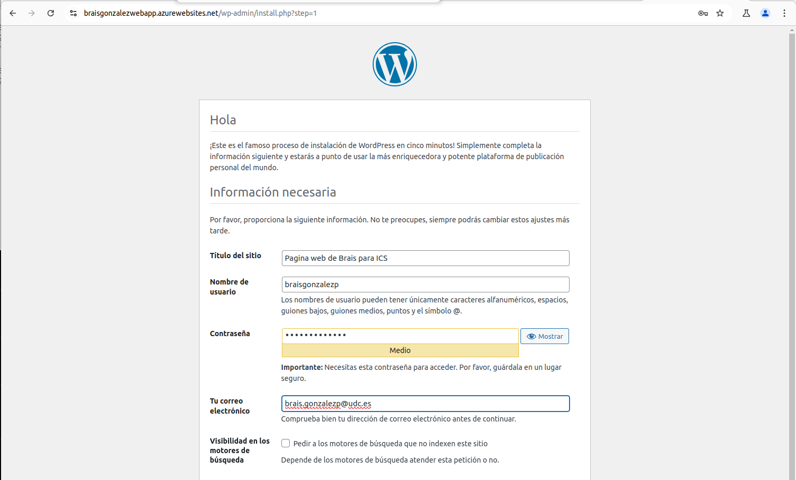

# Practica de Azure (SaaS)
> Brais González Piñeiro \<brais.gonzalezp@udc.es\>
## Tutorial
### Configuración del entorno
Clonamos el repositorio que vamsos a utilizar:
```bash
brais@braisGonzalez:~/Documentos/Azure$ mkdir ics-master
brais@braisGonzalez:~/Documentos/Azure$ cd ics-master/
brais@braisGonzalez:~/Documentos/Azure/ics-master$ git clone -b v1 https://github.com/docker-training/node-  bulletin-board
Clonando en 'node-bulletin-board'...
remote: Enumerating objects: 213, done.
remote: Counting objects: 100% (23/23), done.
remote: Compressing objects: 100% (19/19), done.
remote: Total 213 (delta 8), reused 17 (delta 4), pack-reused 190 (from 1)
Recibiendo objetos: 100% (213/213), 197.64 KiB | 1.28 MiB/s, listo.
Resolviendo deltas: 100% (90/90), listo.
brais@braisGonzalez:~/Documentos/Azure/ics-master$ cd node-bulletin-board/bulletin-board-app/
brais@braisGonzalez:~/Documentos/Azure/ics-master/node-bulletin-board/bulletin-board-app$ ls
app.js   Dockerfile  index.html  package.json  server.js
backend  fonts       LICENSE     readme.md     site.css
brais@braisGonzalez:~/Documentos/Azure/ics-master/node-bulletin-board/bulletin-board-app$
```
Comprobamos que es el mismo dockerfile:
```bash
brais@braisGonzalez:~/Documentos/Azure/ics-master/node-bulletin-board/bulletin-board-app$ cat Dockerfile 
FROM node:6.11.5

WORKDIR /usr/src/app
COPY package.json .
RUN npm install
COPY . .

CMD [ "npm", "start" ]
```
y el mismo json:

```bash
brais@braisGonzalez:~/Documentos/Azure/ics-master/node-bulletin-board/bulletin-board-app$ cat package.json 
{
  "name": "vue-event-bulletin",
  "version": "1.0.0",
  "description": "Demo application for the scotch.io tutorial",
  "main": "server.js",
  "author": "Ryan Chenkie, Jason Lam",
  "license": "MIT",
  "dependencies": {
    "bootstrap": "^3.3.6",
    "ejs": "^2.3.4",
    "express": "^4.13.3",
    "morgan": "^1.6.1",
    "vue": "^1.0.10",
    "vue-resource": "^0.1.17"
  },
  "devDependencies": {
    "body-parser": "^1.14.1",
    "errorhandler": "^1.4.2",
    "method-override": "^2.3.5",
    "morgan": "^1.6.1"
  }
}
```
## DOCKER
Necesitamos usar Docker sin permisos de root por lo que haremos lo siguiente:
1. Creamos un grupo docker(yo ya he trabajado con socker anteriormente por lo que este grupo ya lo tengo creado):
```bash
brais@braisGonzalez:~/Documentos/Azure/ics-master/node-bulletin-board/bulletin-board-app$ sudo groupadd docker
sudo: imposible resolver el anfitrión braisGonzalez: Nombre o servicio desconocido
[sudo] contraseña para brais: 
groupadd: el grupo «docker» ya existe
```
2. Añadimos el usuario al grupo y reiniciamos para guardar cambios:
```bash
brais@braisGonzalez:~/Documentos/Azure/ics-master/node-bulletin-board/bulletin-board-app$  sudo usermod -aG docker $USER
```
## Docker service
Comprobamos que docker esta corriendo correctamente en nuestro sistema operativo:
```bash
brais@braisGonzalez:~/Documentos/Azure/ics-master/node-bulletin-board/bulletin-board-app$ systemctl status docker
● docker.service - Docker Application Container Engine
     Loaded: loaded (/lib/systemd/system/docker.service; enabled; vendor preset: enabled)
     Active: active (running) since Sun 2024-11-24 18:31:51 CET; 39min ago
TriggeredBy: ● docker.socket
       Docs: https://docs.docker.com
   Main PID: 1898 (dockerd)
      Tasks: 30
     Memory: 119.5M
        CPU: 927ms
     CGroup: /system.slice/docker.service
             └─1898 /usr/bin/dockerd -H fd:// --containerd=/run/containerd/containerd.sock

nov 24 18:31:51 braisGonzalez systemd[1]: Starting Docker Application Container Engine...
nov 24 18:31:51 braisGonzalez dockerd[1898]: time="2024-11-24T18:31:51.218050700+01:00" level=info >
nov 24 18:31:51 braisGonzalez dockerd[1898]: time="2024-11-24T18:31:51.279633374+01:00" level=info >
nov 24 18:31:51 braisGonzalez dockerd[1898]: time="2024-11-24T18:31:51.341519782+01:00" level=info >
nov 24 18:31:51 braisGonzalez dockerd[1898]: time="2024-11-24T18:31:51.737800505+01:00" level=info >
nov 24 18:31:51 braisGonzalez dockerd[1898]: time="2024-11-24T18:31:51.783775745+01:00" level=info >
nov 24 18:31:51 braisGonzalez dockerd[1898]: time="2024-11-24T18:31:51.792967665+01:00" level=info >
nov 24 18:31:51 braisGonzalez dockerd[1898]: time="2024-11-24T18:31:51.793342285+01:00" level=info >
nov 24 18:31:51 braisGonzalez dockerd[1898]: time="2024-11-24T18:31:51.833178180+01:00" level=info >
nov 24 18:31:51 braisGonzalez systemd[1]: Started Docker Application Container Engine.
lines 1-22/22 (END)
```
## Docker Image Build
Ya podemos pasar a generar la imagen docker:
```bash
brais@braisGonzalez:~/Documentos/Azure/ics-master/node-bulletin-board/bulletin-board-app$ docker image build -t bulletinboard:1.0 .
[+] Building 30.6s (10/10) FINISHED                                                                 
 => [internal] load .dockerignore                                                              0.0s
 => => transferring context: 2B                                                                0.0s
 => [internal] load build definition from Dockerfile                                           0.0s
 => => transferring dockerfile: 146B                                                           0.0s
 => [internal] load metadata for docker.io/library/node:6.11.5                                 2.1s
 => [internal] load build context                                                              0.0s
 => => transferring context: 32.77kB                                                           0.0s
 => [1/5] FROM docker.io/library/node:6.11.5@sha256:fe109b92edafd9821fbc1c80fd7587a1b4e1ff76  17.9s
 => => resolve docker.io/library/node:6.11.5@sha256:fe109b92edafd9821fbc1c80fd7587a1b4e1ff76f  0.0s
 => => sha256:852391892b9f2cf86cce28977a6594bb5b118d97da4b48c56ea6f5fe18b975d 7.08kB / 7.08kB  0.0s
 => => sha256:ba6bd283713a743ee651be9e0a833547e00c6f31584a948db2df96fded4de 19.26MB / 19.26MB  5.1s
 => => sha256:fe109b92edafd9821fbc1c80fd7587a1b4e1ff76fec3af675869e23e50bbf45 2.04kB / 2.04kB  0.0s
 => => sha256:e1da6883876418aa60725654dbf76dba875d844bba4c20e36d0e9bf56e190f8 2.01kB / 2.01kB  0.0s
 => => sha256:85b1f47fba49da65256f07c8790542a3880e9216f9c491965040f35ce2c6c 52.60MB / 52.60MB  6.0s
 => => sha256:817c8cd48a09f6f7d54fc509d1890d349d1ba1720848531ed8bcb19fccc42 43.23MB / 43.23MB  6.1s
 => => sha256:47cc0ed96dc3a88c79f26dc97950ec81a5c35699f48f07662f99c97412 134.93MB / 134.93MB  13.6s
 => => sha256:8888adcbd08b22208eec8b1719ae91391c156962567f4e443db015e0bb4da65 4.42kB / 4.42kB  6.2s
 => => extracting sha256:85b1f47fba49da65256f07c8790542a3880e9216f9c491965040f35ce2c6ca7a      2.0s
 => => sha256:6f2de60646b92af71b80e4be2594b0506b3ccddf357c5567cbb42403ab2 116.48kB / 116.48kB  6.3s
 => => sha256:1666693bf9968584f1705c17141a510818b1fbd1e7dea99a4e4c4f9038f60 14.42MB / 14.42MB  7.8s
 => => sha256:2fe410df7942f8a05bbed941ffa187db5ed887af54ff8ba9f9e671393da28b1 1.01MB / 1.01MB  6.8s
 => => extracting sha256:ba6bd283713a743ee651be9e0a833547e00c6f31584a948db2df96fded4def55      0.5s
 => => extracting sha256:817c8cd48a09f6f7d54fc509d1890d349d1ba1720848531ed8bcb19fccc42962      1.8s
 => => extracting sha256:47cc0ed96dc3a88c79f26dc97950ec81a5c35699f48f07662f99c97412af6e95      3.1s
 => => extracting sha256:8888adcbd08b22208eec8b1719ae91391c156962567f4e443db015e0bb4da654      0.0s
 => => extracting sha256:6f2de60646b92af71b80e4be2594b0506b3ccddf357c5567cbb42403ab296c8e      0.0s
 => => extracting sha256:1666693bf9968584f1705c17141a510818b1fbd1e7dea99a4e4c4f9038f60e91      0.7s
 => => extracting sha256:2fe410df7942f8a05bbed941ffa187db5ed887af54ff8ba9f9e671393da28b13      0.1s
 => [2/5] WORKDIR /usr/src/app                                                                 0.3s
 => [3/5] COPY package.json .                                                                  0.0s
 => [4/5] RUN npm install                                                                     10.0s
 => [5/5] COPY . .                                                                             0.0s
 => exporting to image                                                                         0.3s 
 => => exporting layers                                                                        0.3s 
 => => writing image sha256:94c32d4df74eba4d67238c56b7187c7fd0800e8389884e04aae105aae8757839   0.0s 
 => => naming to docker.io/library/bulletinboard:1.0                                           0.0s
```
## Docker Container Run
Una vez generada la imagen docker podemos pasar a ejecutarla, para ello necesitamos levantar el contenedor y conectar el puerto 8000 de la máquina local con el 8080 del contenedor. Para ello usaremos lo siguiente:
```bash
brais@braisGonzalez:~/Documentos/Azure/ics-master/node-bulletin-board/bulletin-board-app$ docker container run --publish 8000:8080 --detach --name bb bulletinboard:1.0
74bd1faf2ebb3558b378fcbff76770e368016c5887e32ea2603882b267805854
```
De esta formas ya tendriamos el contenedor corriendo, y para conectarnos solo tendriamos que buscar en nuestro navegador la dirección http://localhost:8000/. El resultado se vería de la siguiente manera:


## Docker ps
Para saber los contenedores que tenmos corriendo haríamos lo siguiente:
```bash
brais@braisGonzalez:~/Documentos/Azure/ics-master/node-bulletin-board/bulletin-board-app$ docker ps
CONTAINER ID   IMAGE               COMMAND                  CREATED         STATUS          PORTS                    NAMES
74bd1faf2ebb   bulletinboard:1.0   "npm start"              5 minutes ago   Up 5 minutes    0.0.0.0:8000->8080/tcp   bb
```
Y para eliminarlo sin pararlo:
```bash
brais@braisGonzalez:~/Documentos/Azure/ics-master/node-bulletin-board/bulletin-board-app$ docker container rm --force bb
bb
```
## Docker images
Se pueden listar todas las imagenes generadas de la siguiente forma:
```bash
brais@braisGonzalez:~/Documentos/Azure/ics-master/node-bulletin-board/bulletin-board-app$ docker images
REPOSITORY                       TAG       IMAGE ID       CREATED          SIZE
bulletinboard                    1.0       94c32d4df74e   14 minutes ago   689MB
```
## Docker rmi
Para eliminar imagenes del sistema se haría:
```bash
brais@braisGonzalez:~/Documentos/Azure/ics-master/node-bulletin-board/bulletin-board-app$ docker rmi 94c32d4df74e
Untagged: bulletinboard:1.0
Deleted: sha256:94c32d4df74eba4d67238c56b7187c7fd0800e8389884e04aae105aae8757839
```
Como resultado al volver al listar las imagenes veríamos:
```bash
brais@braisGonzalez:~/Documentos/Azure/ics-master/node-bulletin-board/bulletin-board-app$ docker images
REPOSITORY                       TAG       IMAGE ID       CREATED          SIZE
```
## Docker Search
También se pueden buscar imágenes, por ejemplo vamos a probar a buscar imágenes de centOS:
```bash
brais@braisGonzalez:~/Documentos/Azure/ics-master/node-bulletin-board/bulletin-board-app$ docker search centos
NAME                           DESCRIPTION                                     STARS     OFFICIAL
centos                         DEPRECATED; The official build of CentOS.       7757      [OK]
centos/postgresql-10-centos7   PostgreSQL is an advanced Object-Relational …   20        
centos/httpd-24-centos8                                                        3         
corpusops/centos               centos corpusops baseimage                      0         
centos/redis-5-centos8                                                         0         
centos/systemd                 systemd enabled base container.                 115       
centos/postgresql-96-centos7   PostgreSQL is an advanced Object-Relational …   45        
centos/postgresql-10-centos8                                                   0         
centos/mysql-80-centos8                                                        0         
centos/mongodb-36-centos7      MongoDB NoSQL database server                   12        
centos/nginx-112-centos7       Platform for running nginx 1.12 or building …   16        
centos/mariadb-103-centos8                                                     2         
centos/postgresql-12-centos8                                                   0         
centos/mysql-56-centos7        MySQL 5.6 SQL database server                   23        
centos/mariadb-101-centos7     MariaDB 10.1 SQL database server                13        
centos/mariadb-102-centos7     MariaDB 10.2 SQL database server                6         
centos/mysql-57-centos7        MySQL 5.7 SQL database server                   95        
centos/ruby-25-centos7         Platform for building and running Ruby 2.5 a…   3         
centos/redis-32-centos7        Redis in-memory data structure store, used a…   6         
centos/httpd-24-centos7        Platform for running Apache httpd 2.4 or bui…   46        
centos/php-56-centos7          Platform for building and running PHP 5.6 ap…   34        
centos/nginx-18-centos7        Platform for running nginx 1.8 or building n…   14        
centos/redis-5-centos7         Redis in-memory data structure store, used a…   0         
centos/python-35-centos7       Platform for building and running Python 3.5…   39        
centos/postgresql-12-centos7   PostgreSQL is an advanced Object-Relational …   5
```
## Docker image pull
Para descargar imágenes haríamos:
```bash
brais@braisGonzalez:~/Documentos/Azure/ics-master/node-bulletin-board/bulletin-board-app$ docker image pull kinogmt/centos-ssh
Using default tag: latest
latest: Pulling from kinogmt/centos-ssh
Image docker.io/kinogmt/centos-ssh:latest uses outdated schema1 manifest format. Please upgrade to a schema2 image for better future compatibility. More information at https://docs.docker.com/registry/spec/deprecated-schema-v1/
a3ed95caeb02: Pull complete 
3b231ed5aa2f: Pull complete 
b73faae918f1: Pull complete 
2f96ec4f912b: Pull complete 
50ad9044db90: Pull complete 
ba40dad95ca2: Pull complete 
1d7a70b1b1da: Pull complete 
365930eae884: Pull complete 
7568f1af3835: Pull complete 
Digest: sha256:acdf7798259f859a8e713f2f88511eef5e0f94cb2d2dec078a1fe169a8aacf63
Status: Downloaded newer image for kinogmt/centos-ssh:latest
docker.io/kinogmt/centos-ssh:latest
```
Vamos a comprobar que se ha descargado correctamente:
```bash
brais@braisGonzalez:~/Documentos/Azure/ics-master/node-bulletin-board/bulletin-board-app$ docker images
REPOSITORY                       TAG       IMAGE ID       CREATED         SIZE
kinogmt/centos-ssh               latest    dc8713dad282   8 years ago     773MB
```
## Docker container run -it
Podemos ejecutar una maquina y conectarnos de la siguiente forma:
```bash
brais@braisGonzalez:~/Documentos/Azure/ics-master/node-bulletin-board/bulletin-board-app$ docker container run -it kinogmt/centos-ssh /bin/bash
[root@754e3f1818f5 /]# rpm -q centos-release
centos-release-6-7.el6.centos.12.3.x86_64
[root@754e3f1818f5 /]# 
```
## Docker logs
Para comprobar los logs de una maquina:
```bash
docker logs <container_id>
```
## Limpieza del sistema
Una vez acabado necesitamos limpiar los contenedores e imágenes que ya no vamos a utilizar, para ello primero veremos que recursos no necesitamos
```bash
brais@braisGonzalez:~/Documentos/Azure/ics-master/node-bulletin-board/bulletin-board-app$ docker image ls
REPOSITORY           TAG       IMAGE ID       CREATED       SIZE
kinogmt/centos-ssh   latest    dc8713dad282   8 years ago   773MB
brais@braisGonzalez:~/Documentos/Azure/ics-master/node-bulletin-board/bulletin-board-app$ docker container ps
CONTAINER ID   IMAGE     COMMAND   CREATED   STATUS    PORTS     NAMES
brais@braisGonzalez:~/Documentos/Azure/ics-master/node-bulletin-board/bulletin-board-app$ docker container ls -a
CONTAINER ID   IMAGE                COMMAND       CREATED         STATUS                       PORTS     NAMES
754e3f1818f5   kinogmt/centos-ssh   "/bin/bash"   7 minutes ago   Exited (127) 3 minutes ago             brave_poincare
```
Ahora eliminaremos primero el contenedor y luego la imagen de la siguiente manera:
```bash
brais@braisGonzalez:~/Documentos/Azure/ics-master/node-bulletin-board/bulletin-board-app$ docker rmi -f dc8713dad282
Untagged: kinogmt/centos-ssh:latest
Untagged: kinogmt/centos-ssh@sha256:acdf7798259f859a8e713f2f88511eef5e0f94cb2d2dec078a1fe169a8aacf63
Deleted: sha256:dc8713dad28219f7be85c1c7ab08fa858905d7b4f78bf4999e6cdcd36eae2377
brais@braisGonzalez:~/Documentos/Azure/ics-master/node-bulletin-board/bulletin-board-app$ docker container rm 754e3f1818f5
754e3f1818f5
```
## AZURE
## Alta cuenta azure
Lo primero que debemos de hacer es darnos de alta en la cuenta de azure:

## Instalar consola de azure
Instalar consola
```bash
curl -sL https://aka.ms/InstallAzureCLIDeb | sudo bash
```
Instalar helm
```bash
brais@braisGonzalez:~/Documentos/Azure/ics-master/node-bulletin-board/bulletin-board-app$ curl https://raw.githubusercontent.com/helm/helm/master/scripts/get-helm-3 | bash
  % Total    % Received % Xferd  Average Speed   Time    Time     Time  Current
                                 Dload  Upload   Total   Spent    Left  Speed
100 11903  100 11903    0     0  39316      0 --:--:-- --:--:-- --:--:-- 39413
Downloading https://get.helm.sh/helm-v3.16.3-linux-amd64.tar.gz
Verifying checksum... Done.
Preparing to install helm into /usr/local/bin
sudo: imposible resolver el anfitrión braisGonzalez: Nombre o servicio desconocido
helm installed into /usr/local/bin/helm
```
## Login a Azure desde consola
```bash
brais@braisGonzalez:~/Documentos/Azure/ics-master/node-bulletin-board/bulletin-board-app$ az login
A web browser has been opened at https://login.microsoftonline.com/organizations/oauth2/v2.0/authorize. Please continue the login in the web browser. If no web browser is available or if the web browser fails to open, use device code flow with `az login --use-device-code`.

Retrieving tenants and subscriptions for the selection...

[Tenant and subscription selection]

No     Subscription name    Subscription ID                       Tenant
-----  -------------------  ------------------------------------  ----------------------
[1] *  Azure for Students   17a8b9ab-44a3-45c0-bef4-c1ae78afaccb  Universidade da Coruña

The default is marked with an *; the default tenant is 'Universidade da Coruña' and subscription is 'Azure for Students' (17a8b9ab-44a3-45c0-bef4-c1ae78afaccb).

Select a subscription and tenant (Type a number or Enter for no changes): 

Tenant: Universidade da Coruña
Subscription: Azure for Students (17a8b9ab-44a3-45c0-bef4-c1ae78afaccb)

[Announcements]
With the new Azure CLI login experience, you can select the subscription you want to use more easily. Learn more about it and its configuration at https://go.microsoft.com/fwlink/?linkid=2271236

If you encounter any problem, please open an issue at https://aka.ms/azclibug

[Warning] The login output has been updated. Please be aware that it no longer displays the full list of available subscriptions by default.
```
## Creación del Container Registry
Para crear imagenes docker privadas primero necesitamos crear un Container Registry. Los pasos a seguir son:
1. Crear grupo de recursos
```bash
brais@braisGonzalez:~/Documentos/Azure/ics-master/node-bulletin-board/bulletin-board-app$ az group create --name miGrupoRecursos --location "West Europe"
{
  "id": "/subscriptions/17a8b9ab-44a3-45c0-bef4-c1ae78afaccb/resourceGroups/miGrupoRecursos",
  "location": "westeurope",
  "managedBy": null,
  "name": "miGrupoRecursos",
  "properties": {
    "provisioningState": "Succeeded"
  },
  "tags": null,
  "type": "Microsoft.Resources/resourceGroups"
}
```

2. Crear el Continer Registry:
```bash
brais@braisGonzalez:~/Documentos/Azure/ics-master/node-bulletin-board/bulletin-board-app$ az acr create --name miplanserviciobrais --resource-group miGrupoRecursos --sku Basic
Resource provider 'Microsoft.ContainerRegistry' used by this operation is not registered. We are registering for you.
Registration succeeded.
{
  "adminUserEnabled": false,
  "anonymousPullEnabled": false,
  "creationDate": "2024-11-24T19:16:09.296503+00:00",
  "dataEndpointEnabled": false,
  "dataEndpointHostNames": [],
  "encryption": {
    "keyVaultProperties": null,
    "status": "disabled"
  },
  "id": "/subscriptions/17a8b9ab-44a3-45c0-bef4-c1ae78afaccb/resourceGroups/miGrupoRecursos/providers/Microsoft.ContainerRegistry/registries/miplanserviciobrais",
  "identity": null,
  "location": "westeurope",
  "loginServer": "miplanserviciobrais.azurecr.io",
  "metadataSearch": "Disabled",
  "name": "miplanserviciobrais",
  "networkRuleBypassOptions": "AzureServices",
  "networkRuleSet": null,
  "policies": {
    "azureAdAuthenticationAsArmPolicy": {
      "status": "enabled"
    },
    "exportPolicy": {
      "status": "enabled"
    },
    "quarantinePolicy": {
      "status": "disabled"
    },
    "retentionPolicy": {
      "days": 7,
      "lastUpdatedTime": "2024-11-24T19:16:17.690389+00:00",
      "status": "disabled"
    },
    "softDeletePolicy": {
      "lastUpdatedTime": "2024-11-24T19:16:17.690446+00:00",
      "retentionDays": 7,
      "status": "disabled"
    },
    "trustPolicy": {
      "status": "disabled",
      "type": "Notary"
    }
  },
  "privateEndpointConnections": [],
  "provisioningState": "Succeeded",
  "publicNetworkAccess": "Enabled",
  "resourceGroup": "miGrupoRecursos",
  "sku": {
    "name": "Basic",
    "tier": "Basic"
  },
  "status": null,
  "systemData": {
    "createdAt": "2024-11-24T19:16:09.296503+00:00",
    "createdBy": "brais.gonzalezp@udc.es",
    "createdByType": "User",
    "lastModifiedAt": "2024-11-24T19:16:09.296503+00:00",
    "lastModifiedBy": "brais.gonzalezp@udc.es",
    "lastModifiedByType": "User"
  },
  "tags": {},
  "type": "Microsoft.ContainerRegistry/registries",
  "zoneRedundancy": "Disabled"
}
```
## Push de la imagen al Container registry de Azure
Primero verificamos que ellogin es correcto:
```bash
brais@braisGonzalez:~/Documentos/Azure/ics-master/node-bulletin-board/bulletin-board-app$ az acr login --name miplanserviciobrais 
Login Succeeded
```
Generamos el tag para hacer el push de la imagen:
```bash
docker tag bulletinboard:1.0 miplanserviciobrais.azurecr.io/bulletinboard:v1
```
Vemos que está bien creada:
```bash
brais@braisGonzalez:~/Documentos/Azure/ics-master/node-bulletin-board/bulletin-board-app$ docker images
REPOSITORY                                     TAG       IMAGE ID       CREATED             SIZE
bulletinboard                                  1.0       94c32d4df74e   About an hour ago   689MB
miplanserviciobrais.azurecr.io/bulletinboard   v1        94c32d4df74e   About an hour ago   689MB
```
Necesitamos habilitar el login ya que se trata de un repo privado, para ello activaremos el admin:
```bash
brais@braisGonzalez:~/Documentos/Azure/ics-master/node-bulletin-board/bulletin-board-app$ az acr update -n miplanserviciobrais --admin-enabled true
{
  "adminUserEnabled": true,
  "anonymousPullEnabled": false,
  "creationDate": "2024-11-24T19:16:09.296503+00:00",
  "dataEndpointEnabled": false,
  "dataEndpointHostNames": [],
  "encryption": {
    "keyVaultProperties": null,
    "status": "disabled"
  },
  "id": "/subscriptions/17a8b9ab-44a3-45c0-bef4-c1ae78afaccb/resourceGroups/miGrupoRecursos/providers/Microsoft.ContainerRegistry/registries/miplanserviciobrais",
  "identity": null,
  "location": "westeurope",
  "loginServer": "miplanserviciobrais.azurecr.io",
  "metadataSearch": "Disabled",
  "name": "miplanserviciobrais",
  "networkRuleBypassOptions": "AzureServices",
  "networkRuleSet": null,
  "policies": {
    "azureAdAuthenticationAsArmPolicy": {
      "status": "enabled"
    },
    "exportPolicy": {
      "status": "enabled"
    },
    "quarantinePolicy": {
      "status": "disabled"
    },
    "retentionPolicy": {
      "days": 7,
      "lastUpdatedTime": "2024-11-24T19:16:17.690389+00:00",
      "status": "disabled"
    },
    "softDeletePolicy": {
      "lastUpdatedTime": "2024-11-24T19:16:17.690446+00:00",
      "retentionDays": 7,
      "status": "disabled"
    },
    "trustPolicy": {
      "status": "disabled",
      "type": "Notary"
    }
  },
  "privateEndpointConnections": [],
  "provisioningState": "Succeeded",
  "publicNetworkAccess": "Enabled",
  "resourceGroup": "miGrupoRecursos",
  "sku": {
    "name": "Basic",
    "tier": "Basic"
  },
  "status": null,
  "systemData": {
    "createdAt": "2024-11-24T19:16:09.296503+00:00",
    "createdBy": "brais.gonzalezp@udc.es",
    "createdByType": "User",
    "lastModifiedAt": "2024-11-24T19:30:53.003328+00:00",
    "lastModifiedBy": "brais.gonzalezp@udc.es",
    "lastModifiedByType": "User"
  },
  "tags": {},
  "type": "Microsoft.ContainerRegistry/registries",
  "zoneRedundancy": "Disabled"
}
```
Como podemos ver en la consola de azure se ha activado correctamente:


Probamos ahora a hacer login desde la consola:
```bash
brais@braisGonzalez:~/Documentos/Azure/ics-master/node-bulletin-board/bulletin-board-app$ docker login miplanserviciobrais.azurecr.io
Username: miplanserviciobrais
Password: 
Login Succeeded
```
Ahora ya podemos hacer el push:
```bash
brais@braisGonzalez:~/Documentos/Azure/ics-master/node-bulletin-board/bulletin-board-app$ docker push miplanserviciobrais.azurecr.io/bulletinboard:v1
The push refers to repository [miplanserviciobrais.azurecr.io/bulletinboard]
4992278b9852: Pushed 
91e6543813c9: Pushed 
38391c71900f: Pushed 
10e7258451c2: Pushed 
dd883cbb0cf7: Pushed 
a3a3f69aebe8: Pushed 
0da372da714b: Pushed 
bf3841becf9d: Pushed 
63866df00998: Pushed 
2f9128310b77: Pushed 
d9a5f9b8d5c2: Pushed 
c01c63c6823d: Pushed 
v1: digest: sha256:f1c2c38a32e53174971c576ea558a0ff2a5058277e32a2430b288ef3a1b63cee size: 2841
```
Y comprobamos que la imagen está subida en azure:


## Creación del contenedor con la imagen recién subida a Azure

Creamos el contenedor con las instrucciones necesarias:
```bash
brais@braisGonzalez:~/Documentos/Azure/ics-master/node-bulletin-board/bulletin-board-app$ az container create --resource-group miGrupoRecursos --name test-bulletinboard --image miplanserviciobrais.azurecr.io/bulletinboard:v1 --dns-name-label testbulletinboard --ports 8080 --os-type Linux --cpu 1 --memory 1.5
Image registry username: miplanserviciobrais
Image registry password: 
{
  "confidentialComputeProperties": null,
  "containerGroupProfile": null,
  "containers": [
    {
      "command": null,
      "configMap": {
        "keyValuePairs": {}
      },
      "environmentVariables": [],
      "image": "miplanserviciobrais.azurecr.io/bulletinboard:v1",
      "instanceView": {
        "currentState": {
          "detailStatus": "",
          "exitCode": null,
          "finishTime": null,
          "startTime": "2024-11-24T19:56:35.710000+00:00",
          "state": "Running"
        },
        "events": [
          {
            "count": 1,
            "firstTimestamp": "2024-11-24T19:56:00+00:00",
            "lastTimestamp": "2024-11-24T19:56:00+00:00",
            "message": "pulling image \"miplanserviciobrais.azurecr.io/bulletinboard@sha256:f1c2c38a32e53174971c576ea558a0ff2a5058277e32a2430b288ef3a1b63cee\"",
            "name": "Pulling",
            "type": "Normal"
          },
          {
            "count": 1,
            "firstTimestamp": "2024-11-24T19:56:24+00:00",
            "lastTimestamp": "2024-11-24T19:56:24+00:00",
            "message": "Successfully pulled image \"miplanserviciobrais.azurecr.io/bulletinboard@sha256:f1c2c38a32e53174971c576ea558a0ff2a5058277e32a2430b288ef3a1b63cee\"",
            "name": "Pulled",
            "type": "Normal"
          },
          {
            "count": 1,
            "firstTimestamp": "2024-11-24T19:56:35+00:00",
            "lastTimestamp": "2024-11-24T19:56:35+00:00",
            "message": "Started container",
            "name": "Started",
            "type": "Normal"
          }
        ],
        "previousState": null,
        "restartCount": 0
      },
      "livenessProbe": null,
      "name": "test-bulletinboard",
      "ports": [
        {
          "port": 8080,
          "protocol": "TCP"
        }
      ],
      "readinessProbe": null,
      "resources": {
        "limits": null,
        "requests": {
          "cpu": 1.0,
          "gpu": null,
          "memoryInGb": 1.5
        }
      },
      "securityContext": null,
      "volumeMounts": null
    }
  ],
  "diagnostics": null,
  "dnsConfig": null,
  "encryptionProperties": null,
  "extensions": null,
  "id": "/subscriptions/17a8b9ab-44a3-45c0-bef4-c1ae78afaccb/resourceGroups/miGrupoRecursos/providers/Microsoft.ContainerInstance/containerGroups/test-bulletinboard",
  "identity": null,
  "imageRegistryCredentials": [
    {
      "identity": null,
      "identityUrl": null,
      "isDelegatedIdentity": false,
      "password": null,
      "server": "miplanserviciobrais.azurecr.io",
      "username": "miplanserviciobrais"
    }
  ],
  "initContainers": [],
  "instanceView": {
    "events": [],
    "state": "Running"
  },
  "ipAddress": {
    "autoGeneratedDomainNameLabelScope": "Unsecure",
    "dnsNameLabel": "testbulletinboard",
    "fqdn": "testbulletinboard.westeurope.azurecontainer.io",
    "ip": "20.103.109.169",
    "ports": [
      {
        "port": 8080,
        "protocol": "TCP"
      }
    ],
    "type": "Public"
  },
  "isCreatedFromStandbyPool": false,
  "location": "westeurope",
  "name": "test-bulletinboard",
  "osType": "Linux",
  "priority": null,
  "provisioningState": "Succeeded",
  "resourceGroup": "miGrupoRecursos",
  "restartPolicy": null,
  "sku": "Standard",
  "standbyPoolProfile": null,
  "subnetIds": null,
  "tags": {},
  "type": "Microsoft.ContainerInstance/containerGroups",
  "volumes": null,
  "zones": null
}
```
## Visitando la página web
Ahora solo tenemos que comprobar que todo hay ido bien:
```bash
brais@braisGonzalez:~/Documentos/Azure/ics-master/node-bulletin-board/bulletin-board-app$ az container logs --resource-group miGrupoRecursos --name test-bulletinboard

> vue-event-bulletin@1.0.0 start /usr/src/app
> node server.js

Magic happens on port 8080...
GET / 200 9.161 ms - 1825
```
y vemos si el contenedor está en ejecución y entramos en el FQDN para comprobar si se puede acceder:


También podemos observar los logs para obtener mas información:
```bash
brais@braisGonzalez:~/Documentos/Azure/ics-master/node-bulletin-board/bulletin-board-app$ az container logs --resource-group miGrupoRecursos --name test-bulletinboard

> vue-event-bulletin@1.0.0 start /usr/src/app
> node server.js

Magic happens on port 8080...
GET / 200 9.161 ms - 1825
GET / 200 1.816 ms - 1825
GET / 200 3.316 ms - 1825
GET /site.css 200 1.991 ms - 1227
GET /node_modules/bootstrap/dist/css/bootstrap.min.css 200 5.729 ms - 121457
GET /app.js 200 1.383 ms - 1238
GET /node_modules/vue-resource/dist/vue-resource.min.js 200 6.708 ms - 9193
GET /node_modules/vue/dist/vue.min.js 200 6.485 ms - 77475
GET /fonts/geomanist/hinted-Geomanist-Book.woff2 200 2.824 ms - 23504
GET /node_modules/bootstrap/dist/fonts/glyphicons-halflings-regular.woff2 200 4.055 ms - 18028
GET /api/events 200 6.159 ms - 216
GET /favicon.ico 404 3.245 ms - 150
```
# Documentación y despliegue de la práctica
## Descripción del despliegue que se ha elegido
> Opcion elegida: 2 (8 puntos)

En esta práctica desplegaremos un contenedor con dos servicios(WordPress y SQL) mediante la utilización de docker-compose. Los recursos que se utilizarán para la realización de la practica serán

  1. Azure WebApp: para lanzar el docker-compose sobre Azure App Service será necesario desplegarlo sobre      Azure WebApp.
  2. Azure App Service: es un servicio basado en HTTP para hospedar aplicaciones web, API REST
  y back-ends para dispositivos móviles. Las aplicaciones se ejecutan y escalan fácilmente en
  los entornos basados tanto en Windows como en Linux.


La comunicaión entre los dos servicios se haŕa de manera interna en el propio contenedor por lo que solo estará expuesto el puerto 80 al exterior.

Para que la practica sea valida habra que:

  - Generar un appservice en Linux
  - Una vez generado el webapp es necesario fijar en su configuración los appsettings que le
  indiquen la ruta y user/pass de vuestro azure container registry para que busque allí las
  imágenes y no en DockerHub (por defecto)

## Documentación de la práctica:
Lo primero de todo será descargar las imágenes de WordPress y MySQL desde DockerHub:
```bash
brais@braisGonzalez:~/Documentos/Azure/ics-master$ docker pull wordpress:latest
latest: Pulling from library/wordpress
2d429b9e73a6: Pull complete 
8e3574ead1d9: Pull complete 
33ddd73cf168: Pull complete 
03e622ab6113: Pull complete 
3d465c9a467d: Pull complete 
c99b33b2d2df: Pull complete 
8944b2c2d493: Pull complete 
b95e19029c21: Pull complete 
3ecc49d93144: Pull complete 
413b3a10b41e: Pull complete 
93e37cdea03d: Pull complete 
2c3cdaf28ff9: Pull complete 
bebb38845b62: Pull complete 
4f4fb700ef54: Pull complete 
1062c4bf27a2: Pull complete 
0f3c44dd6c5b: Pull complete 
205f781f096b: Pull complete 
147b34766441: Pull complete 
cc509c872df2: Pull complete 
a6ef3423d3cc: Pull complete 
8bd2c82cab52: Pull complete 
cdd30a8da961: Pull complete 
Digest: sha256:cd3ff8311e62c3a5d95feaa502f8416d547d98af339b3384647d6fc2a9f76813
Status: Downloaded newer image for wordpress:latest
docker.io/library/wordpress:latest
brais@braisGonzalez:~/Documentos/Azure/ics-master$ docker pull mysql:5.7
5.7: Pulling from library/mysql
20e4dcae4c69: Pull complete 
1c56c3d4ce74: Pull complete 
e9f03a1c24ce: Pull complete 
68c3898c2015: Pull complete 
6b95a940e7b6: Pull complete 
90986bb8de6e: Pull complete 
ae71319cb779: Pull complete 
ffc89e9dfd88: Pull complete 
43d05e938198: Pull complete 
064b2d298fba: Pull complete 
df9a4d85569b: Pull complete 
Digest: sha256:4bc6bc963e6d8443453676cae56536f4b8156d78bae03c0145cbe47c2aad73bb
Status: Downloaded newer image for mysql:5.7
docker.io/library/mysql:5.7
```
Y a continuación podemos comprobar que se han descargado correctamente:
```bash
brais@braisGonzalez:~/Documentos/Azure/ics-master$ docker images
REPOSITORY                                     TAG       IMAGE ID       CREATED         SIZE
bulletinboard                                  1.0       94c32d4df74e   24 hours ago    689MB
miplanserviciobrais.azurecr.io/bulletinboard   v1        94c32d4df74e   24 hours ago    689MB
wordpress                                      latest    2d7bb61bd13c   3 days ago      701MB
mysql
```
Una vez hecho esto esto necesitamos crear un docker-compose.yml que se encargará de gestionar los contenedores y sus recursos asociados:
```bash
version: '3'

volumes:
  db:
  wordpress:

services:
  db:
    image: mysql:5.7
    restart: always
    environment:
      - MYSQL_ROOT_PASSWORD=root
      - MYSQL_DATABASE=wordpress
      - MYSQL_USER=test
      - MYSQL_PASSWORD=test
    ports:
      - "3306:3306"
    volumes:
      - db:/var/lib/mysql

  wordpress:
    depends_on:
      - db
    image: wordpress:latest
    restart: always
    environment:
      - WORDPRESS_DB_HOST=db:3306
      - WORDPRESS_DB_USER=test
      - WORDPRESS_DB_PASSWORD=test
      - WORDPRESS_DB_NAME=wordpress
    ports:
      - "8080:80"
    volumes:
      - wordpress:/var/www/html
```
Como podemos observar, especificamos que se van a desplegar dos servicios, el wordpress y mysql, además se creará un volumne asociado a cada servicio, configurando para MySQL, un usuario y base de
datos de prueba, y exponiendo el puerto 3306. Por otro lado, tambien configuramos las variables de entorno para permitir a wordpress la conexión a mysql, y exponemos el servicio en nuestro puerto 8080 enlanzándolo con el puerto 80 del contenedor.

A continuación tendríamos que configurar Azure y para ello, crear el grupo de recursos y el registro de contenedores. En nuestro caso ya están creados en el tutorial, sin embargo los comandos a seguir serían los siguientes:
```bash
az group create --name miGrupoRecursos --location "West Europe"
az acr create --name miplanserviciobrais --resource-group
miGrupoRecursos --sku Basic
az acr login --name miplanserviciorbrais
```
Lo siguiente sería cagar las imágenes en el sistema de registro de contenedores, para lo cual es necesario hacer un tag de las imágenes:

```bash
brais@braisGonzalez:~/Documentos/Azure/ics-master/practica$ docker tag wordpress:latest miplanserviciobrais.azurecr.io/wordpress:latest
brais@braisGonzalez:~/Documentos/Azure/ics-master/practica$ docker tag mysql:5.7 miplanserviciobrais.azurecr.io/mysql:5.7
```
Podemos observar el resultado:
```bash
brais@braisGonzalez:~/Documentos/Azure/ics-master/practica$ docker images
REPOSITORY                                     TAG       IMAGE ID       CREATED         SIZE
bulletinboard                                  1.0       94c32d4df74e   24 hours ago    689MB
miplanserviciobrais.azurecr.io/bulletinboard   v1        94c32d4df74e   24 hours ago    689MB
wordpress                                      latest    2d7bb61bd13c   3 days ago      701MB
miplanserviciobrais.azurecr.io/wordpress       latest    2d7bb61bd13c   3 days ago      701MB
mysql                                          5.7       5107333e08a8   11 months ago   501MB
miplanserviciobrais.azurecr.io/mysql           5.7       5107333e08a8   11 months ago   501MB
```
A continuación iniciaremos sesión en el registro de contenedores de azure y pushearemos las imágenes:
```bash
brais@braisGonzalez:~/Documentos/Azure/ics-master/practica$ docker login miplanserviciobrais.azurecr.io
Username: miplanserviciobrais
Password: 
Login Succeeded
brais@braisGonzalez:~/Documentos/Azure/ics-master/practica$ docker push miplanserviciobrais.azurecr.io/wordpress:latest
The push refers to repository [miplanserviciobrais.azurecr.io/wordpress]
6f5fd5bafb34: Pushed 
01079f02f5ed: Pushed 
66c5204d2e9d: Pushed 
8d0a94721237: Pushed 
cf37ea0671a8: Pushed 
a5776cd94686: Pushed 
3d33297cbd82: Pushed 
559e2d856e79: Pushed 
5f70bf18a086: Pushed 
8f638ab1d32b: Pushed 
28f77e56d9c5: Pushed 
ed5a99586453: Pushed 
60e91fffce72: Pushed 
ae88dccc5d2b: Pushed 
c60d471531c1: Pushed 
7227b6c8a3cb: Pushed 
1393d37092ba: Pushed 
0a8d603e281a: Pushed 
a3606c464e19: Pushed 
4e29311a3799: Pushed 
b13704a409b2: Pushed 
c3548211b826: Pushed 
latest: digest: sha256:93783651b4ecb04a92e8567706ca8a783261a885848fde0b3a3613cd5ee1959e size: 4917
brais@braisGonzalez:~/Documentos/Azure/ics-master/practica$ docker push miplanserviciobrais.azurecr.io/mysql:5.7
The push refers to repository [miplanserviciobrais.azurecr.io/mysql]
441e16cac4fe: Pushed 
73cb62467b8f: Pushed 
337ec6bae222: Pushed 
532b66f4569d: Pushed 
0d9e9a9ce9e4: Pushed 
4555572a6bb2: Pushed 
8527ccd6bd85: Pushed 
d76a5f910f6b: Pushed 
8b2952eb02aa: Pushed 
7ff7abf4911b: Pushed 
cff044e18624: Pushed 
5.7: digest: sha256:4b6c4935195233bc10b617df3cc725a9ddd5a7f10351a7bf573bea0b5ded7649 size: 2618
```
Y como podemos observar en la consola web de azure los cambios surtieron efecto:


A continuacion crearemos el app service que mencionamos en la descripción del despliegue, para ello. Que se ahrá de la siguiente forma:
```bash
brais@braisGonzalez:~/Documentos/Azure/ics-master/practica$ az appservice plan create --name braisgonzalez-appservice-plan --resource-group miGrupoRecursos --sku B1 --is-linux
Readonly attribute name will be ignored in class <class 'azure.mgmt.web.v2023_01_01.models._models_py3.AppServicePlan'>
Resource provider 'Microsoft.Web' used by this operation is not registered. We are registering for you.
Registration succeeded.
{
  "elasticScaleEnabled": false,
  "extendedLocation": null,
  "freeOfferExpirationTime": "2025-05-25T19:00:55.206666",
  "geoRegion": "West Europe",
  "hostingEnvironmentProfile": null,
  "hyperV": false,
  "id": "/subscriptions/17a8b9ab-44a3-45c0-bef4-c1ae78afaccb/resourceGroups/miGrupoRecursos/providers/Microsoft.Web/serverfarms/braisgonzalez-appservice-plan",
  "isSpot": false,
  "isXenon": false,
  "kind": "linux",
  "kubeEnvironmentProfile": null,
  "location": "westeurope",
  "maximumElasticWorkerCount": 1,
  "maximumNumberOfWorkers": 0,
  "name": "braisgonzalez-appservice-plan",
  "numberOfSites": 0,
  "numberOfWorkers": 1,
  "perSiteScaling": false,
  "provisioningState": "Succeeded",
  "reserved": true,
  "resourceGroup": "miGrupoRecursos",
  "sku": {
    "capabilities": null,
    "capacity": 1,
    "family": "B",
    "locations": null,
    "name": "B1",
    "size": "B1",
    "skuCapacity": null,
    "tier": "Basic"
  },
  "spotExpirationTime": null,
  "status": "Ready",
  "subscription": "17a8b9ab-44a3-45c0-bef4-c1ae78afaccb",
  "tags": null,
  "targetWorkerCount": 0,
  "targetWorkerSizeId": 0,
  "type": "Microsoft.Web/serverfarms",
  "workerTierName": null,
  "zoneRedundant": false
}
```
Y despues, crearemos el webapp de la siguiente manera:
```bash
brais@braisGonzalez:~/Documentos/Azure/ics-master/practica$ az webapp create --name BraisGonzalezWebApp --plan braisgonzalez-appservice-plan --resource-group miGrupoRecursos --multicontainer-config-file docker-compose.yml --multicontainer-config-type COMPOSE
{
  "availabilityState": "Normal",
  "clientAffinityEnabled": true,
  "clientCertEnabled": false,
  "clientCertExclusionPaths": null,
  "clientCertMode": "Required",
  "cloningInfo": null,
  "containerSize": 0,
  "customDomainVerificationId": "D5E187ADD7E9AC408E647FDBEC2C188FDB2AAF2756B19830C86E41DDDBD52FA5",
  "dailyMemoryTimeQuota": 0,
  "daprConfig": null,
  "defaultHostName": "braisgonzalezwebapp.azurewebsites.net",
  "enabled": true,
  "enabledHostNames": [
    "braisgonzalezwebapp.azurewebsites.net",
    "braisgonzalezwebapp.scm.azurewebsites.net"
  ],
  "extendedLocation": null,
  "ftpPublishingUrl": "ftps://waws-prod-am2-681.ftp.azurewebsites.windows.net/site/wwwroot",
  "hostNameSslStates": [
    {
      "certificateResourceId": null,
      "hostType": "Standard",
      "ipBasedSslResult": null,
      "ipBasedSslState": "NotConfigured",
      "name": "braisgonzalezwebapp.azurewebsites.net",
      "sslState": "Disabled",
      "thumbprint": null,
      "toUpdate": null,
      "toUpdateIpBasedSsl": null,
      "virtualIPv6": null,
      "virtualIp": null
    },
    {
      "certificateResourceId": null,
      "hostType": "Repository",
      "ipBasedSslResult": null,
      "ipBasedSslState": "NotConfigured",
      "name": "braisgonzalezwebapp.scm.azurewebsites.net",
      "sslState": "Disabled",
      "thumbprint": null,
      "toUpdate": null,
      "toUpdateIpBasedSsl": null,
      "virtualIPv6": null,
      "virtualIp": null
    }
  ],
  "hostNames": [
    "braisgonzalezwebapp.azurewebsites.net"
  ],
  "hostNamesDisabled": false,
  "hostingEnvironmentProfile": null,
  "httpsOnly": false,
  "hyperV": false,
  "id": "/subscriptions/17a8b9ab-44a3-45c0-bef4-c1ae78afaccb/resourceGroups/miGrupoRecursos/providers/Microsoft.Web/sites/BraisGonzalezWebApp",
  "identity": null,
  "inProgressOperationId": null,
  "isDefaultContainer": null,
  "isXenon": false,
  "keyVaultReferenceIdentity": "SystemAssigned",
  "kind": "app,linux,container",
  "lastModifiedTimeUtc": "2024-11-25T19:02:41.073333",
  "location": "West Europe",
  "managedEnvironmentId": null,
  "maxNumberOfWorkers": null,
  "name": "BraisGonzalezWebApp",
  "outboundIpAddresses": "20.73.127.255,20.76.64.122,20.76.65.118,20.73.127.254,20.76.65.248,20.76.65.249,20.105.224.34",
  "possibleOutboundIpAddresses": "20.73.127.255,20.76.64.122,20.76.65.118,20.73.127.254,20.76.65.248,20.76.65.249,20.76.64.123,20.76.68.160,20.76.68.161,20.76.70.134,20.76.70.135,20.76.70.242,20.76.71.245,20.76.65.81,20.76.65.96,20.76.65.97,20.76.70.185,20.76.65.157,20.76.65.164,20.76.65.166,20.76.65.225,20.76.65.227,20.76.66.34,20.76.66.52,20.105.224.34",
  "publicNetworkAccess": null,
  "redundancyMode": "None",
  "repositorySiteName": "BraisGonzalezWebApp",
  "reserved": true,
  "resourceConfig": null,
  "resourceGroup": "miGrupoRecursos",
  "scmSiteAlsoStopped": false,
  "serverFarmId": "/subscriptions/17a8b9ab-44a3-45c0-bef4-c1ae78afaccb/resourceGroups/miGrupoRecursos/providers/Microsoft.Web/serverfarms/braisgonzalez-appservice-plan",
  "siteConfig": {
    "acrUseManagedIdentityCreds": false,
    "acrUserManagedIdentityId": null,
    "alwaysOn": false,
    "antivirusScanEnabled": null,
    "apiDefinition": null,
    "apiManagementConfig": null,
    "appCommandLine": null,
    "appSettings": null,
    "autoHealEnabled": null,
    "autoHealRules": null,
    "autoSwapSlotName": null,
    "azureMonitorLogCategories": null,
    "azureStorageAccounts": null,
    "clusteringEnabled": false,
    "connectionStrings": null,
    "cors": null,
    "customAppPoolIdentityAdminState": null,
    "customAppPoolIdentityTenantState": null,
    "defaultDocuments": null,
    "detailedErrorLoggingEnabled": null,
    "documentRoot": null,
    "elasticWebAppScaleLimit": 0,
    "experiments": null,
    "fileChangeAuditEnabled": null,
    "ftpsState": null,
    "functionAppScaleLimit": null,
    "functionsRuntimeScaleMonitoringEnabled": null,
    "handlerMappings": null,
    "healthCheckPath": null,
    "http20Enabled": false,
    "http20ProxyFlag": null,
    "httpLoggingEnabled": null,
    "ipSecurityRestrictions": [
      {
        "action": "Allow",
        "description": "Allow all access",
        "headers": null,
        "ipAddress": "Any",
        "name": "Allow all",
        "priority": 2147483647,
        "subnetMask": null,
        "subnetTrafficTag": null,
        "tag": null,
        "vnetSubnetResourceId": null,
        "vnetTrafficTag": null
      }
    ],
    "ipSecurityRestrictionsDefaultAction": null,
    "javaContainer": null,
    "javaContainerVersion": null,
    "javaVersion": null,
    "keyVaultReferenceIdentity": null,
    "limits": null,
    "linuxFxVersion": "",
    "loadBalancing": null,
    "localMySqlEnabled": null,
    "logsDirectorySizeLimit": null,
    "machineKey": null,
    "managedPipelineMode": null,
    "managedServiceIdentityId": null,
    "metadata": null,
    "minTlsCipherSuite": null,
    "minTlsVersion": null,
    "minimumElasticInstanceCount": 0,
    "netFrameworkVersion": null,
    "nodeVersion": null,
    "numberOfWorkers": 1,
    "phpVersion": null,
    "powerShellVersion": null,
    "preWarmedInstanceCount": null,
    "publicNetworkAccess": null,
    "publishingPassword": null,
    "publishingUsername": null,
    "push": null,
    "pythonVersion": null,
    "remoteDebuggingEnabled": null,
    "remoteDebuggingVersion": null,
    "requestTracingEnabled": null,
    "requestTracingExpirationTime": null,
    "routingRules": null,
    "runtimeADUser": null,
    "runtimeADUserPassword": null,
    "scmIpSecurityRestrictions": [
      {
        "action": "Allow",
        "description": "Allow all access",
        "headers": null,
        "ipAddress": "Any",
        "name": "Allow all",
        "priority": 2147483647,
        "subnetMask": null,
        "subnetTrafficTag": null,
        "tag": null,
        "vnetSubnetResourceId": null,
        "vnetTrafficTag": null
      }
    ],
    "scmIpSecurityRestrictionsDefaultAction": null,
    "scmIpSecurityRestrictionsUseMain": null,
    "scmMinTlsCipherSuite": null,
    "scmMinTlsVersion": null,
    "scmSupportedTlsCipherSuites": null,
    "scmType": null,
    "sitePort": null,
    "sitePrivateLinkHostEnabled": null,
    "storageType": null,
    "supportedTlsCipherSuites": null,
    "tracingOptions": null,
    "use32BitWorkerProcess": null,
    "virtualApplications": null,
    "vnetName": null,
    "vnetPrivatePortsCount": null,
    "vnetRouteAllEnabled": null,
    "webSocketsEnabled": null,
    "websiteTimeZone": null,
    "winAuthAdminState": null,
    "winAuthTenantState": null,
    "windowsConfiguredStacks": null,
    "windowsFxVersion": null,
    "xManagedServiceIdentityId": null
  },
  "slotSwapStatus": null,
  "state": "Running",
  "storageAccountRequired": false,
  "suspendedTill": null,
  "tags": null,
  "targetSwapSlot": null,
  "trafficManagerHostNames": null,
  "type": "Microsoft.Web/sites",
  "usageState": "Normal",
  "virtualNetworkSubnetId": null,
  "vnetContentShareEnabled": false,
  "vnetImagePullEnabled": false,
  "vnetRouteAllEnabled": false,
  "workloadProfileName": null
}
```
Y ahora configuraremos la appweb para que acceda al registro de contenedores previamente creado:
```bash
brais@braisGonzalez:~/Documentos/Azure/ics-master/practica$ az webapp config container set --name BraisGonzalezWebApp --resource-group miGrupoRecursos --docker-registry-server-url miplanserviciobrais.azurecr.io --docker-registry-server-user miplanserviciobrais --docker-registry-server-password vU6rPyT0ZgSL2vqQiE6RikyoIM7McnNlSWxsV9c1iz+ACRARnFWR
Option '--docker-registry-server-url' has been deprecated and will be removed in a future release. Use '--container-registry-url' instead.
Option '--docker-registry-server-user' has been deprecated and will be removed in a future release. Use '--container-registry-user' instead.
Option '--docker-registry-server-password' has been deprecated and will be removed in a future release. Use '--container-registry-password' instead.
App settings have been redacted. Use `az webapp/logicapp/functionapp config appsettings list` to view.
[
  {
    "name": "DOCKER_REGISTRY_SERVER_URL",
    "slotSetting": false,
    "value": "miplanserviciobrais.azurecr.io"
  },
  {
    "name": "DOCKER_REGISTRY_SERVER_USERNAME",
    "slotSetting": false,
    "value": "miplanserviciobrais"
  },
  {
    "name": "DOCKER_REGISTRY_SERVER_PASSWORD",
    "slotSetting": false,
    "value": null
  },
  {
    "name": "DOCKER_CUSTOM_IMAGE_NAME",
    "value": "COMPOSE|dmVyc2lvbjogJzMnCgp2b2x1bWVzOgogIGRiOgogIHdvcmRwcmVzczoKCnNlcnZpY2VzOgogIGRiOgogICAgaW1hZ2U6IG15c3FsOjUuNwogICAgcmVzdGFydDogYWx3YXlzCiAgICBlbnZpcm9ubWVudDoKICAgICAgLSBNWVNRTF9ST09UX1BBU1NXT1JEPXJvb3QKICAgICAgLSBNWVNRTF9EQVRBQkFTRT13b3JkcHJlc3MKICAgICAgLSBNWVNRTF9VU0VSPXRlc3QKICAgICAgLSBNWVNRTF9QQVNTV09SRD10ZXN0CiAgICBwb3J0czoKICAgICAgLSAiMzMwNjozMzA2IgogICAgdm9sdW1lczoKICAgICAgLSBkYjovdmFyL2xpYi9teXNxbAoKICB3b3JkcHJlc3M6CiAgICBkZXBlbmRzX29uOgogICAgICAtIGRiCiAgICBpbWFnZTogd29yZHByZXNzOmxhdGVzdAogICAgcmVzdGFydDogYWx3YXlzCiAgICBlbnZpcm9ubWVudDoKICAgICAgLSBXT1JEUFJFU1NfREJfSE9TVD1kYjozMzA2CiAgICAgIC0gV09SRFBSRVNTX0RCX1VTRVI9dGVzdAogICAgICAtIFdPUkRQUkVTU19EQl9QQVNTV09SRD10ZXN0CiAgICAgIC0gV09SRFBSRVNTX0RCX05BTUU9d29yZHByZXNzCiAgICBwb3J0czoKICAgICAgLSAiODA4MDo4MCIKICAgIHZvbHVtZXM6CiAgICAgIC0gd29yZHByZXNzOi92YXIvd3d3L2h0bWwK"
  }
]
```
Por último es necesario hacer la aplicación persistente, ya que las aplicaciones multicontenedor lo necesitan para funcionar de forma correcta. Lo que hay que hacer para lograrlo es hacer que la configuración de Docker Compose debe apunte a una ubicación de almacenamiento
fuera del contenedor. Para habilitarlo hay que:
```bash
brais@braisGonzalez:~/Documentos/Azure/ics-master/practica$ az webapp config appsettings set --resource-group miGrupoRecursos --name BraisGonzalezWebApp --settings WEBSITES_ENABLE_APP_SERVICE_STORAGE=TRUE
App settings have been redacted. Use `az webapp/logicapp/functionapp config appsettings list` to view.
[
  {
    "name": "DOCKER_REGISTRY_SERVER_URL",
    "slotSetting": false,
    "value": null
  },
  {
    "name": "DOCKER_REGISTRY_SERVER_USERNAME",
    "slotSetting": false,
    "value": null
  },
  {
    "name": "DOCKER_REGISTRY_SERVER_PASSWORD",
    "slotSetting": false,
    "value": null
  },
  {
    "name": "WEBSITES_ENABLE_APP_SERVICE_STORAGE",
    "slotSetting": false,
    "value": null
  }
]
```
A continuación ya podemos comprobar que nuestra aplicación esta corriendo el la consola web de Azure:


Por ultimo solo quedaría acceder al dominio en nuestro caso sería http://braisgonzalezwebapp.azurewebsites.net y configurar wordpress, de la siguiente manera:

1. Elegimos el idioma:


2. Configuramos el sitio



3. Iniciamos sesión


4. Creamos una nueva entrada en wordpress


